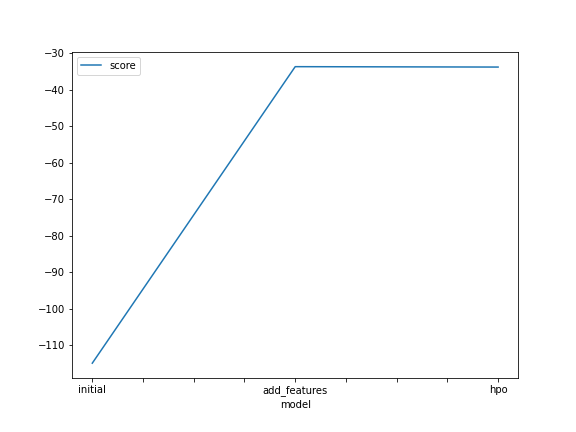
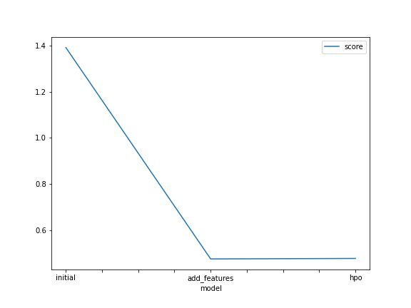

# Report: Predict Bike Sharing Demand with AutoGluon Solution
#### Junqi Chen

## Initial Training
### What did you realize when you tried to submit your predictions? What changes were needed to the output of the predictor to submit your results?
Kaggle will reject the submission if we don't set everything to be > 0. Therefore, I manually set the negative values to zero. 

### What was the top ranked model that performed?
WeightedEnsemble_L3 

## Exploratory data analysis and feature creation
### What did the exploratory analysis find and how did you add additional features?
- Got a better understanding of the features
    - Binary variables: holiday, workingday
    - Variable approx normally distributed: temp, atemp
    - Right skewed variables: windspeed, causal, registered, count
- datetime variable could be informative because hypothetically day of the week and time of the day are factors that could impact bike sharing demand.
    - Therefore, I extracted the following variables from datetime:
        - Month
        - Day of week
        - hour of day

### How much better did your model preform after adding additional features and why do you think that is?
TODO: Add your explanation

## Hyper parameter tuning
### How much better did your model preform after trying different hyper parameters?
TODO: Add your explanation

### If you were given more time with this dataset, where do you think you would spend more time?
TODO: Add your explanation

### Create a table with the models you ran, the hyperparameters modified, and the kaggle score.
|model|hpo1|hpo2|hpo3|score|
|--|--|--|--|--|
|initial|?|?|?|?|
|add_features|?|?|?|?|
|hpo|?|?|?|?|

### Create a line plot showing the top model score for the three (or more) training runs during the project.

TODO: Replace the image below with your own.

### Create a line plot showing the top kaggle score for the three (or more) prediction submissions during the project.

TODO: Replace the image below with your own.

## Summary
TODO: Add your explanation
